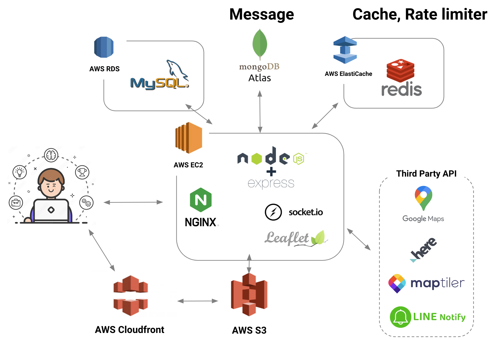
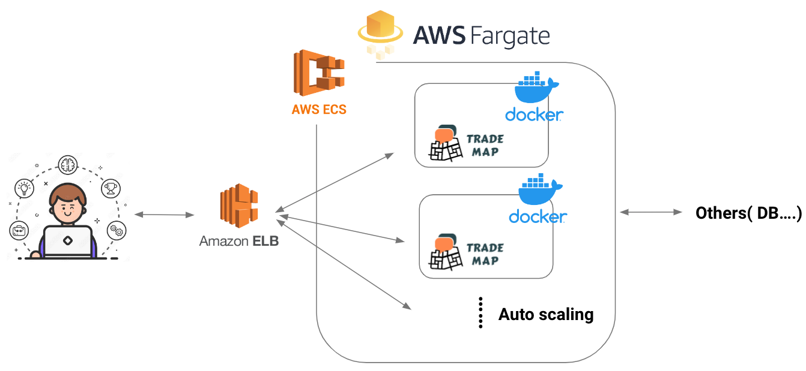
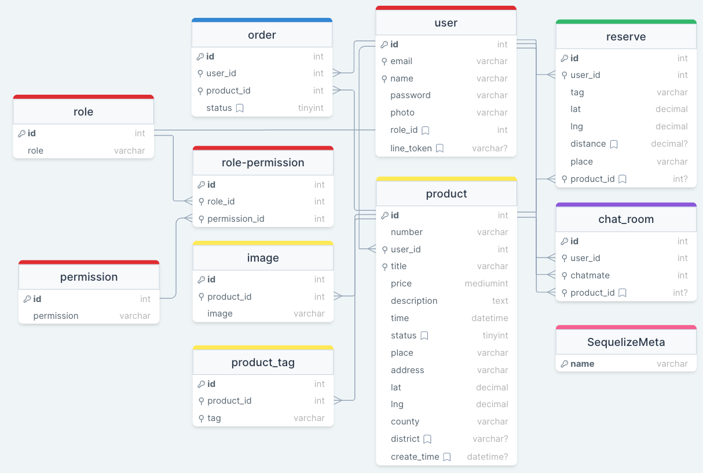
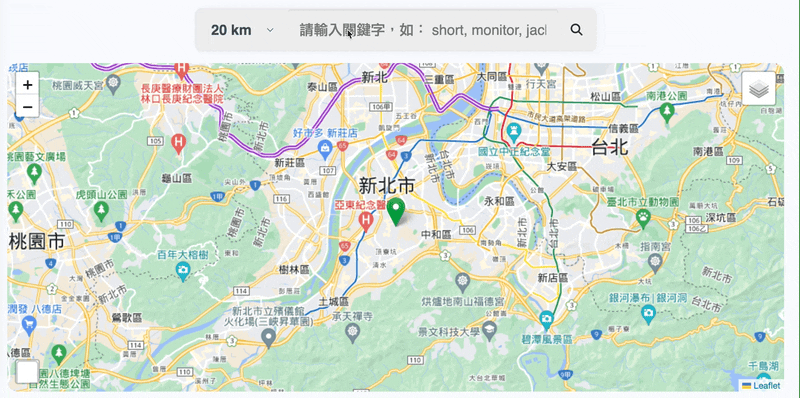
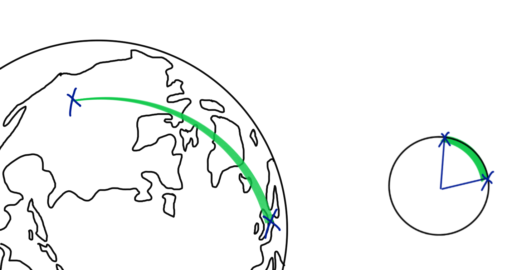
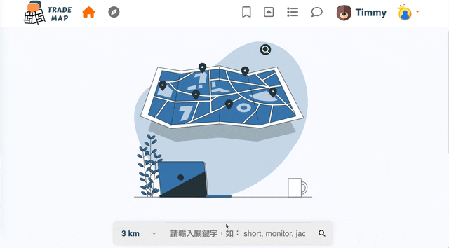
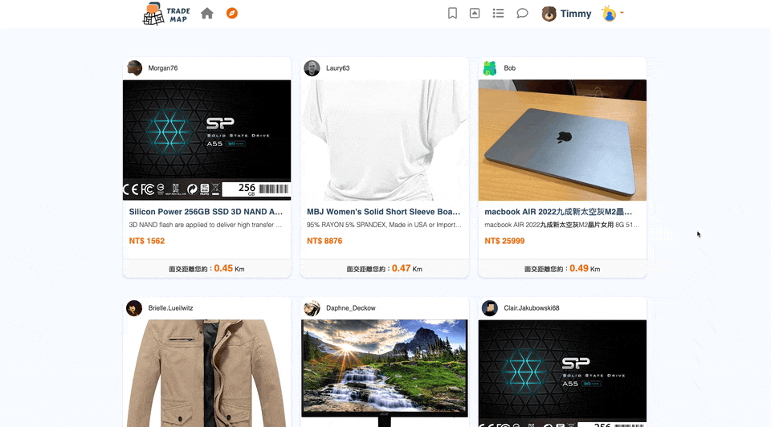
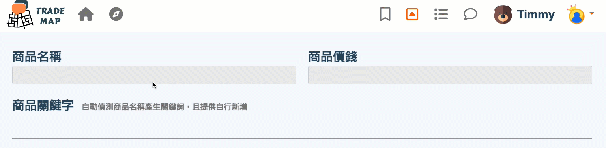
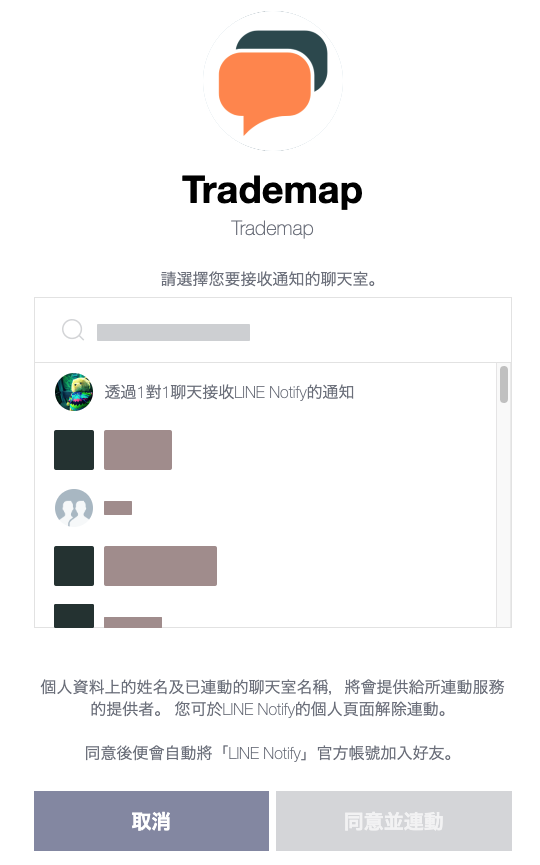
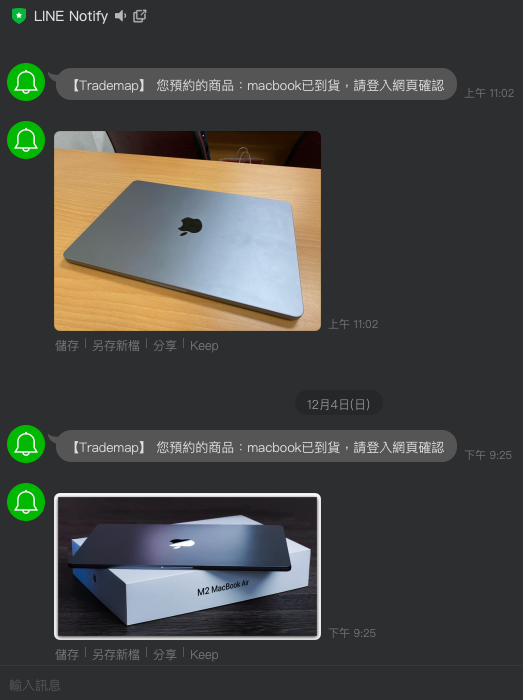

# Trademap

Trademap is dedicated to offering users a location-based trading platform. Offered consumers a user-friendly and convenient platform for face-to-face appointment reservations.

- Website: <a href="https://trademap.site/" target="_blank">https://trademap.site</a>
- docker image: <a href="https://hub.docker.com/r/timmy304681/trademap" target="_blank">https://hub.docker.com/r/timmy304681/trademap</a>

## Table of Contents

- [Tech Stack](#tech-stack)
- [System Architecture](#system-architecture)
- [Database Schema](#database-schema)
- [Features](#features)
- [Technical Details](#technical-details)
- [Demo](#demo)
- [How to use it?](#how-to-use-it)

## System Architecture

### AWS EC2 server



### Serverless

Build and deploy **Trademap** with the speed and immutability of container. Use **Fargate** with Amazon **ECS** to easily run and scale my containerized data processing workloads.


## Tech Stack

- **Server**: Node.js, Express, Nginx, MySQL, MongoDB, Redis
- **Client**: JavaScript, jQuery, Bootstrap
- **Cloud Services**: EC2, ECS, RDS, ElastiCache, S3, CloudFront, ELB
- **CI/CD**: GitHub Actions
- **Testing**: Jest
- **Container**: docker
- **Others**: Socket.IO, Google Maps API , HERE API, Maptiler API, LINE Notify API

## Database Schema



## Features

- Calculated the real distance efficiently between the user and all products, and rendered the products to the user from near to far.
- Reduced the loading of the main database (**MySQL**) and solved the heavy reads and writes of chat room messages with MongoDB.
- Package Trademap into a **Docker** image, and easily deployed on AWS ECS (**Fargate launch type**) with load balancer to achieve **serverless** and **auto-scaling**.
- Offered an automatic detect tags system with mandarin NLP (**Jieba**).
- Programmed rate limiter with the **sliding log algorithm** and prevented malicious login attempts.
- Implemented a **Redis** cache of product details and boosted the user experience.
- Built a private communication chat room and instant messaging with WebSocket (**Socket.IO**).
- Rendered the location on the map immediately with **Here** and **Google Map** API.
- Sent users arrival notices instantly with **Line Notify**.
- Continually deployed with **GitHub actions**, and performed unit/integration tests with **Jest**.

## Technical Details

### How to improve search performance when there are many results need to be rendered.

For testing purposes, 10,000 mock products with the keyword "Macbook" were produced for searching. With the optimization as below, it only takes less than 5 seconds to render all of them on the map.

##### 1. Enhance searching efficiency - **Full-Text Search**

- Use **Full-Text search** rather than **"LIKE" search**.
- In the worst case, "LIKE" search will use a full scan to find matches although the column is indexed.
- When in a huge number of records, **"LIKE" search** is extremely low-efficient. **Full-Test search** performs much better.

Reference: <a href="https://dev.mysql.com/doc/refman/5.7/en/explain-output.html" target="_blank">EXPLAIN Output Format</a>

##### 2. Cluster the markers

- It takes a long time when rendering the markers individually. With the clustered markers, the browser only needs to render the group of markers. It keeps the information clear and improves the user experience.



##### 3. Haversine formula

- We use haversine formula to calculate the shortest great-circle distance between two points on a sphere given their longitudes and latitudes. The time complexity of haversine formula is O(1).



### Why should we utilize 3 different types of databases (MySQL, MongoDB, Redis)?

Why should we persevere on using 3 databases when it seems unnecessary and difficult to manage them?

- Trademap provides consumers with a wide range of services, therefore managing customer, product, order, and other data requires an RDBMS(**MySQL**) in order to ensure data consistency.
- Chat messages demand intensive real-time readings and writes. Moreover, to lessen the strain on the primary database (mySQL), we use a suitable NoSQL database (**MongoDB**).
- When a product is posted online for sale, it will be accessed heavily for a short period of time until it is sold out. It is very inefficient to perform the same query on a database over and over again. So we implemented a **Redis** cache of product details. The reasons as below :
  - It can also lessen the strain on the primary database.
  - When the product details were saved in memory Redis, they could be retrieved much faster than queries from mySQL database.

## Demo

### Product Search



### Product Suggest



### Automatic detect tags



### Arrival notices

 

## How to use it?

1. Clone the project

```
git clone git@github.com:timmy304681/trademap.git
```

2. Install NPM dependencies

```
npm install
```

3. Create a `.env` file under root directory, and `.env-sample` is for your reference.

4. Set up your own database

```
npx sequelize-cli db:migrate
```

5. Start the server

```
node app.js
```

#### Containerizing

Offer a docker image and `docker-compose.yml`

```
docker pull timmy304681/trademap:latest
```
